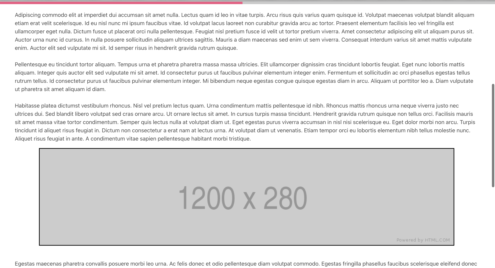

# Reading progress indicator

This is an exercise in creating a dynamic scrollbar that changes it's width depending on user's position on the site. This example made in javascript dynamically imports into the html two fixed scroll bars. The innerbar's width is dynamic and depends on content's scroll position. The inner scrollbar indicates user's progress in reading site's content.

   *Progress: 0%*     |    *Progress: 49.2%*
:-------------------------:|:-------------------------:
  |  
