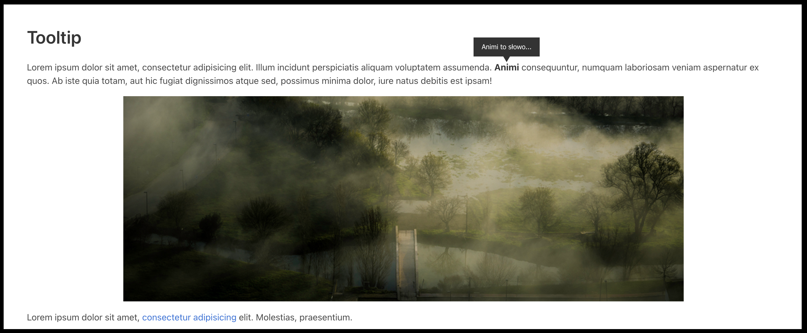

# Custom Tooltip

This is an exercise in dynamically creating a custom tooltip that pops over elements on the website. This example made in javascript upon mouse-hovering specific elements on the website dynamically imports into the html styled tooltip elements. After un-hovering the elements the tooltips are dynamically removed from the html.
_____

   
   
   

