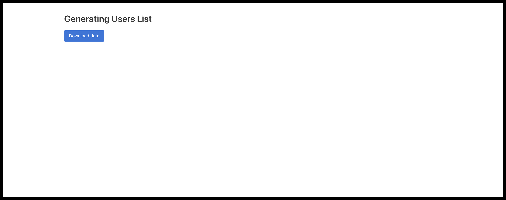
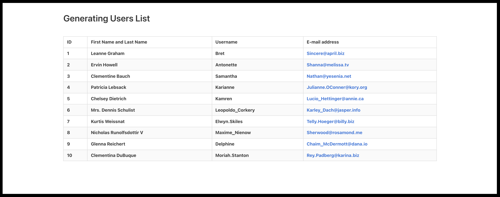

# Custom Tooltip

This is an exercise in dynamically fetching information from an external website and displaying it on the user's/owner's website. This example made in javascript upon clicking the "Download data" button dynamically creates a list of users downloaded from the jsonplaceholder website. The data downloaded from the external website is converted from string into json then displayed in dynamically rendered tables.
 

   
   

